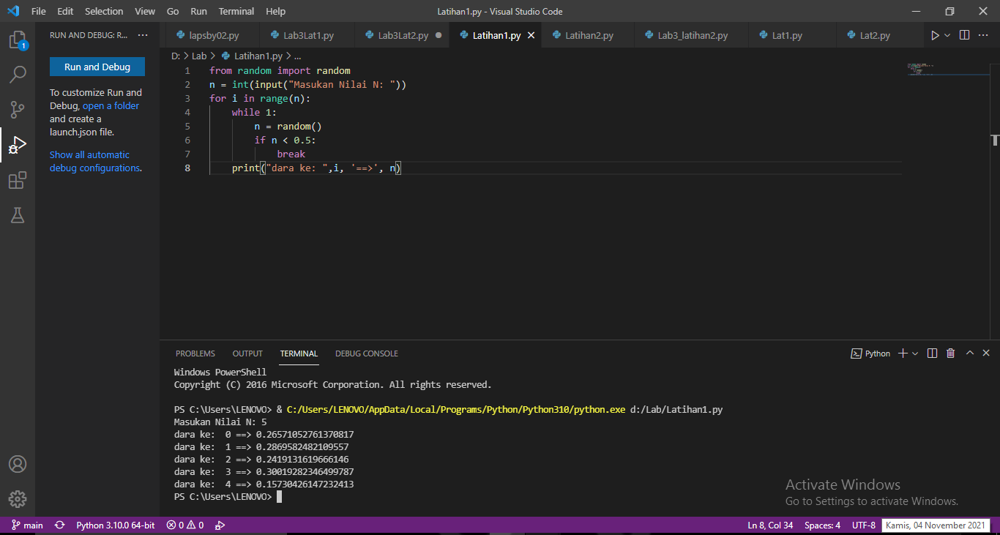
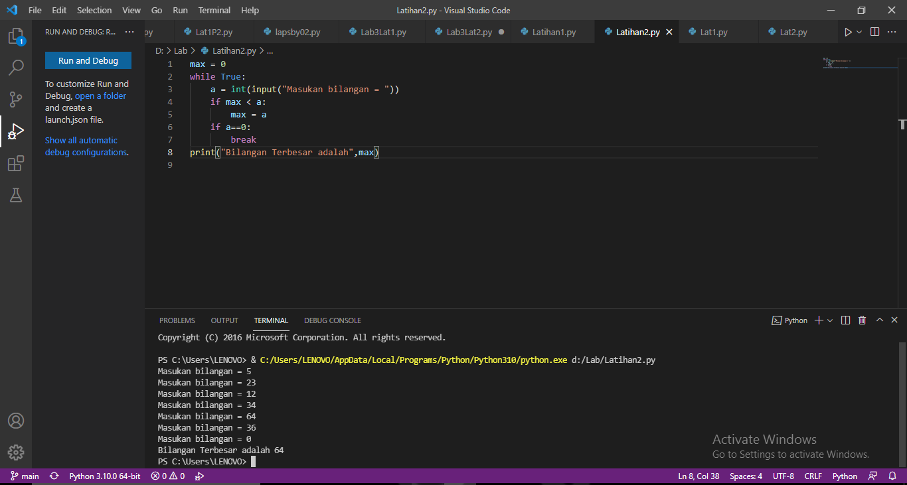
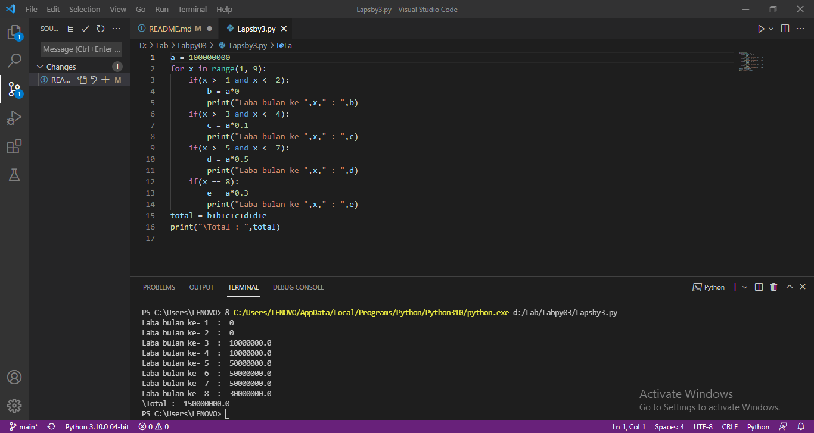

# Labpy03

## Latihan1
1. Tampilakn n jumlah bilangan acak yang lebih kecil dari 0.5
2. Nilai n diisi pada saat runtime
3. Kalian bisa menggunakan kominasi while dan for untuk menyelesaikannya
4. Gunakan fungsi random() yang dapat diimport terlebih dahulu

- Langkah-langkah
1. Masukan fungsi random terlebih dahulu
2. Deklarasi interger
3. Masukan deskripsi kombinasi for untuk menyelesaikannya
4. Masukan nilai jumlah (n) : 0.5
Mencetak data ke-1 sampai ke-5 hasil nilai kurang dari 0.5
5. Selesai

#### Program dan Output



```bash 
from random import random
n = int(input("Masukan Nilai N: "))
for i in range(n):
    while 1:
        n = random()
        if n < 0.5:
            break
    print("dara ke: ",i, '==>', n)
```

## Latihan2
Membuat program untuk menampilkan bilangan terbesar dari n buat data yang diinput, kemudian masukaan angka 0 untuk berhenti.
1. Mulai
2. Mencetak "menampilkan bilangan, berhenti ketika bilangan 0, menampilkan bilangan terbesar"
4. bilangan bulat maks = 0
5. Menggunakan fungsi perulangan while true, hingga menampilkan perulangan sampai batas tertentu.
6. Memasukan bilangan integer pada "a"
7. Menggunakan fungsi if jika max kurang dari nilai a, maka max sama dengan a
8. Mengunakan fungsi jika nilai a adalah 0 maka fungsi break artinya perulangan berhenti jika menulis nilai 0.
9. Mencetak nilai paling besar setelah istirahat, sehingga menampilkan nilai terbesar diantara bilangan tersebut dalam perulangan.
10. Selesai

### Program dan Output



```bash
max = 0
while True:
    a = int(input("Masukan bilangan = "))
    if max < a:
        max = a
    if a==0:
        break
print("Bilangan Terbesar adalah",max)
```

## Tugas Praktikum3
Membuat program sederhana dengan perulangan: 

Seorang pengusaha menginvestasikan uangnya untuk memulai usahanya dengan modal awal 100 juta,
- Pada bulan pertama dan kedua belum mendapatkan laba
- Pada bulan ketiga mulai mendapatkan laba sebesar 1%
- Pada bulan kelima pendapatan meningkat laba sebesar 5%
- Pada bulan kedepalan mengalami penurunan keuntungan sebesar 2%, sehingga laba menjadi 3%
Hitunglah total keuntungan selama 8 bulan berjalan usahanya!

- Langkah-langkah
1. Mulai
2. Mencetak "Program menghitung laba dengan modal awal 100 juta"
3. Membuat Note
4. Mencetak Bulan pertama dan kedua = 0%
5. Mencetak bulan ke 3 = 1%
6. Mencetak bulan ke 5 = 5%
7. Mencetak bulan ke 8 = 2%
8. integer a = 100.000.000( modal awal)
9. Menggunakan fungsi looping for pada nilai x 1-9 untuk menampilkan bulan 1 sampai bulan 8.
10. Menggunakan fungsi if, untuk menghitung laba bulan 1 sampai 8
11. Bulan pertama dan kedua laba adalah 0
12. Bulan ke 3 dan ke 4 mendapat laba 1% sehingga modal di kali 1% = keuntungan
13. Bulan ke 5 mendapatkan laba 5%, sehingga modal dikali 5% = keuntungan
14. Bulan ke 8 mmendapatkan penurunan laba 2% sehingga keuntungan menurun dari bulan sebelumnya, modal dikali 3% = keuntungan.
15. Menghitung jumlah total laba dengan menjumlah keuntungan dari bulan ke 1 sampai bulan 8, hasilnya adalah total keuntungan yang didapat.
16. Selesai

### Program dan Output



```bash
a = 100000000
for x in range(1, 9):
    if(x >= 1 and x <= 2):
        b = a*0
        print("Laba bulan ke-",x," : ",b)
    if(x >= 3 and x <= 4):
        c = a*0.1
        print("Laba bulan ke-",x," : ",c)
    if(x >= 5 and x <= 7):
        d = a*0.5
        print("Laba bulan ke-",x," : ",d)
    if(x == 8):
        e = a*0.3
        print("Laba bulan ke-",x," : ",e)
total = b+b+c+c+d+d+e
print("\Total : ",total)
```

## Terima kasih